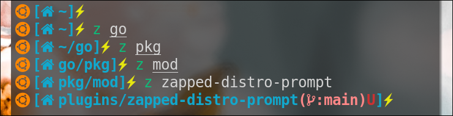

# ⚡Zapped-Distro-Prompt
A Customized Distro Prompt to use with [Zap](https://www.zapzsh.com)




## 📖 Table of Contents

- [✨ Features](#features)
- [🚀 Installation](#installation)
- [🛠️ Usage](#usage)
- [🗑️ Uninstall](#uninstall)
- [🐛 Bugs or Requests](#bugs-or-requests)
- [🤝 Contributing](#contributing)
- [📄 License](#license)
- [🙏 Acknowledgments](#acknowledgments)

## ✨ Features

- **Distros**: Includes most of the major distros for prompt.
- **Git**: Has git functionalities to track changes of git repo.
- **Stay Motivated**: Get motivational & thought provoking quotes.

## 🚀 Installation
Please note that you should have the following installed on your system.
- [Zsh](https://www.zsh.org) as your Shell.
- [Zap](https://www.zapzsh.com) Plugin Manager for Zsh.
- [Nerd Font](https://github.com/ryanoasis/nerd-fonts) for displaying Distros in Prompt.

 Using [Zap](https://github.com/zap-zsh/zap) Plugin Manager add this to your `.zshrc`
```zsh
plug "jollySleeper/zapped-distro-prompt"
```

## 🛠️ Usage
- Just Open your Terminal with ZSH & Zap

## 🗑️ Uninstall

Sorry to hear that this project didn't meet your expectations. Please help us with your feedback.
For uninstalling remove `plug "jollySleeper/zapped-distro-prompt"` from `.zshrc`.

## 🐛 Bugs or Requests

If you encounter any problem(s) feel free to open an [issue](https://github.com/jollySleeper/Zapped-Distro-Prompt/issues/new).
If you feel the project is missing a feature, please raise an [issue](https://github.com/jollySleeper/Zapped-Distro-Prompt/issues/new) with `FeatureRequest` as heading.

## 🤝 Contributing

Contributions are welcome! Please follow these steps:

1. Fork the repository.
2. Create a new branch (`git checkout -b feature/YourFeature`).
3. Make your changes and commit them (`git commit -m 'Add some feature'`).
4. Push to the branch (`git push origin feature/YourFeature`).
5. Open a pull request.

## 📄 License

This project is licensed under the MIT License - see the [LICENSE](https://github.com/jollySleeper/Zapped-Distro-Prompt/blob/main/LICENSE) file for details.

## 🙏 Acknowledgments

- This Prompt takes inspiration from [Zap-Prompt](https://github.com/zap-zsh/zap-prompt).
- Disto functionalities is inspired from [Distro-Prompt](https://github.com/MAHcodes/distro-prompt)
